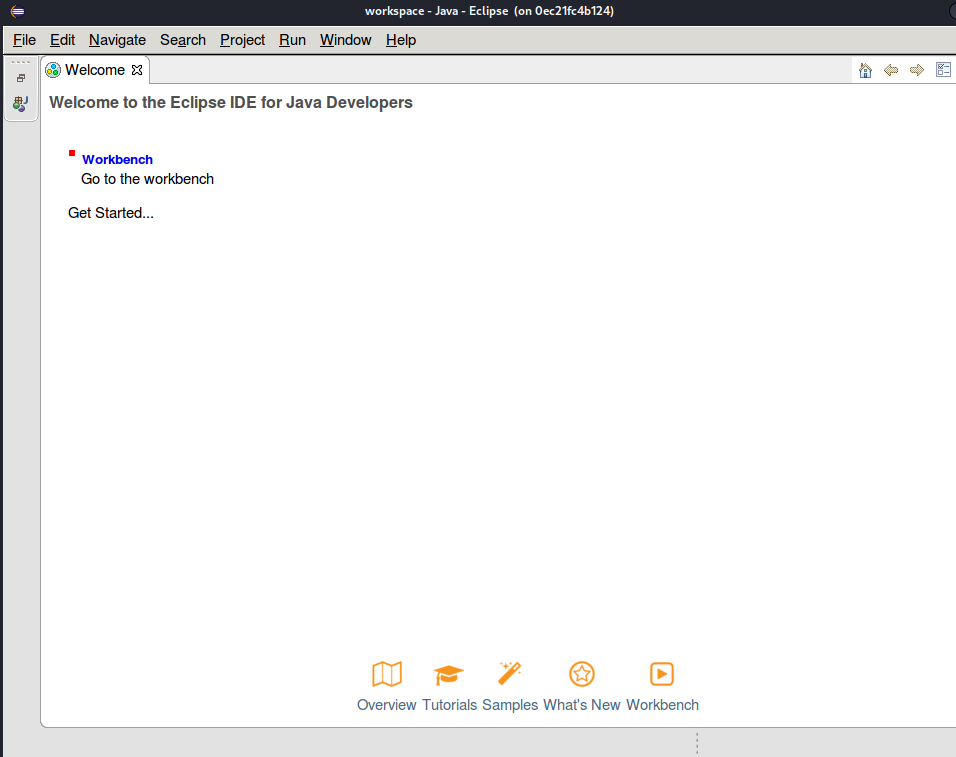

# PPS-Unidad1-Actividad1-JulioManuelTatoPulido

Tenemos varios objetivos:

> [Crear un entorno de desarrollo Eclipse con docker](#Eclipse-Docker)

> [Instalar extensiones en un IDE](#Instalar-extensiones)

> [Probar los entornos de Desarrollo](#Prueba-entornos) 
---
## Eclipse Docker

1. Primero creamos las carpetas necesarias y cambiamos el propietario:
~~~
sudo mkdir -p  $HOME/docker/eclipse/datos
sudo chown -R kali:kali eclipse
~~~

2. Configuramos el entorno gráfico:

~~~
export DISPLAY=:0
startxwin -- -listen tcp &
xhost + 
~~~

3. Lanzamos el contenedor:

~~~
sudo docker run -ti --rm \
           --ulimit nofile=8096:8096\
           -e DISPLAY=$DISPLAY \
	       -e artifactory_host='IP:PUERTO'\
		   --name eclipse \
           -v /tmp/.X11-unix:/tmp/.X11-unix \
           -v `pwd`:/workspace \
           -v $HOME/docker/eclipse/datos:/home/developer \
           dockeruc/eclipse
~~~

## Instalar extensiones

Las extensiones de un IDE nos van a facilitar la labor de programar, hacer más flexible nuestro IDE, además de hacer nuestros código más seguro.
Tenemos muchas extensiones, tanto para lenguajes de programación específicos como para el IDE.

__Las siguientes operaciones las puedes hacer desde el entorno Eclipse que hemos creado o puedes utilizar el IDE que prefieras en tu equipo__
>__Busca cuáles son las mejores extensiones de eclipse para programadores y las añades desde la tienda de tu IDE__
>__ Busca y escribe para qué sirven estos plugins: Checkstyle, Sonar Lint.__
>__Instala los plugins y complementos que has encontrado. Además busca e instala los plugins Checkstyle y Sonar Lint.__

## Prueba entornos

El entorno de desarrollo nos sirve para crear nuestras aplicaciones y además podemos comprobar los errores que tienen, problemas de seguridad, etc. por lo que desde allí vamos a poder corregirlos.
>__Descarga el código fuente de un proyecto java o python: compila, enlaza y ejecutaló. Tienes algunos ejemplos en la carpeta Sources de este repositorio__
>__Utiliza las herramientas de depuración de Eclipse o Netbeans para depurar el proyecto, y las diferentes extensiones para ver información, problemas, etc.__

---
## ENTREGA
>__Crea un repositorio  con nombre PPS-Unidad1Actividad1-Tu nombre que contenga las respuestas a las preguntas y las evidencias de que has realizado las operaciones indicadas.__

>__Sube a la plataforma, tanto el repositorio comprimido como la dirección a tu repositorio de Github.__